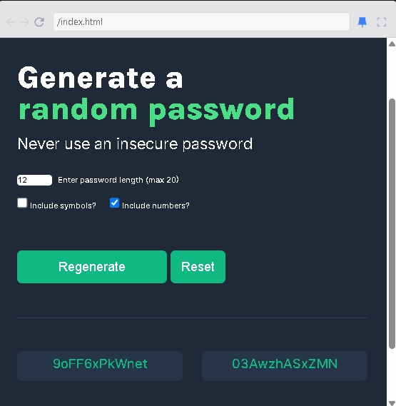

# Password Generator

This project is a simple web-based random password generator. It allows users to create secure passwords with customizable options such as length, inclusion of symbols, and numbers.

## Features

- Generate random passwords with a length between 5 and 15 characters.
- Option to include symbols and numbers in the generated passwords.
- Display two generated passwords at a time.
- Copy passwords to the clipboard with a single click.
- Reset the form to default settings.

## Technologies Used
- HTML
- CSS
- JavaScript

## How to Run
1. Clone the repository and run index.html
2. click on this [link](https://mypasswgen.netlify.app/)
